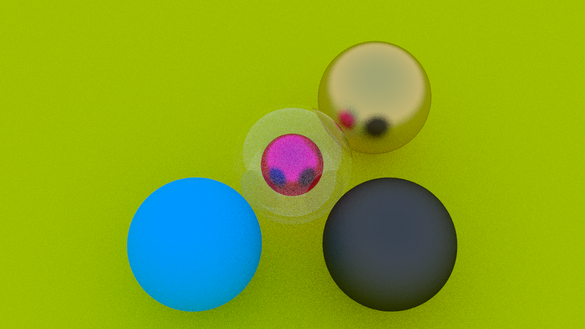

# Raytracer in Java
A raytracer written in Java 18 without external libraries.  
Following the guide [_Ray Tracing in One Weekend_](https://raytracing.github.io/books/RayTracingInOneWeekend.html) by Peter Shirley.  

I have implemented everything up to "Defocus Blur" and made it render 
multithreaded to make it faster.

<!-- ## Runtime:
CPU: Ryzen 7 1700 (3.7 GHz) with 16 Threads
 - `480×270`: ~1.45 seconds
 - `960×540`: ~4.49 seconds
 - `1920×1080`: ~17.41 seconds -->

## Sample image:
